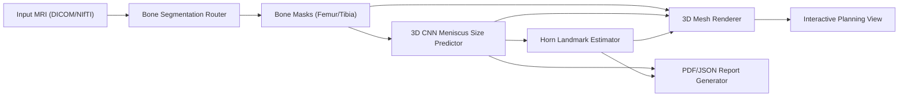

# UI Wireframe (Orthopaedic Planning Style)

## Layout

- Left pane: case inputs and workflow controls
- Right pane: interactive 3D viewport + output artifacts
- Bottom strip: report/download status

## Functional blocks

## Viewer toggles

- Femur mesh
- Tibia mesh
- Meniscus allograft overlay
- Horn landmarks
- Measurements (from legend/text overlays)

